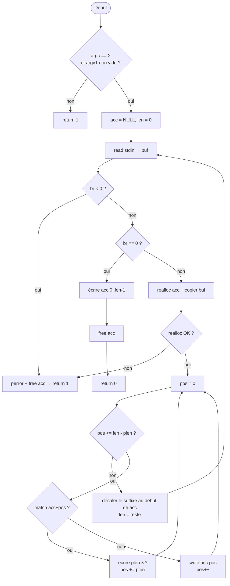

# 🎯 Rank 03 — Solutions Finales (Best-Of)

## 📋 Cheat Sheet

| # | Exercice | ~Lignes | Mémo clé |
|---|----------|---------|----------|
| 1 | `broken_gnl` | 69 | Cache `buf` + `pos`/`got` + `read(BUFFER_SIZE)` + `join()` |
| 2 | `filter` | 69 | `buf` → `acc` + scan `pos`, `*`, décaler le suffixe (`match`) |
| 3 | `n_queens` | 40 | `g_n`, `g_row[]`, `safe(col,row)`, `putnbr` |
| 4 | `permutations` | 35 | Tri + `g_in` / `g_out` / `g_used` + `perm(pos)` |
| 5 | `powerset` | 30 | `g_val[]` / `g_cur[]` / `g_nb` + `bt(idx, cur_len, sum, goal)` |
| 6 | `rip` | 45 | `bal` (depth), `find` → `min`, `gen` avec ce `min` |

---

# Level 1

---

## 1. `broken_gnl`

> **Fichiers** : `get_next_line.c` + `get_next_line.h` — **Autorisé** : `read`, `free`, `malloc`
>
> Référence : `level1/broken_gnl/gnl_soluce_2.c` (même algorithme ; dans la fiche les identifiants sont renommés pour la mémorisation : `join`, `buf`, `pos`, `got`, `seg_start`, `seg_len`).

> [!TIP]
> **Pattern exam** : buffer statique `buf` + `read(fd, buf, BUFFER_SIZE)` + concat par blocs (`join`).
> Conforme au sujet (`BUFFER_SIZE` utilisé dans `read`), peu de `malloc` par ligne.

#### `get_next_line.h`
```c
#ifndef GNL
# define GNL

# include <stdlib.h>
# include <unistd.h>

# ifndef BUFFER_SIZE
#  define BUFFER_SIZE 10
# endif

char	*get_next_line(int fd);

#endif
```

#### `get_next_line.c`
```c
#include "get_next_line.h"

static char *join(char *line, char *buf, int n)
{
	char *out;
	int i = 0;
	int j = 0;
	
	while (line && line[i])
		i++;
	out = malloc(i + n + 1);
	if (!out)
		return(free(line), NULL);
	while (j < i)
	{
		out[j] = line[j];
		j++;
	}
	j = 0;
	while (j < n)
	{
		out[i + j] = buf[j];
		j++;
	}
	out[i + n] = '\0';
	free(line);
	return (out);
}

char *get_next_line(int fd)
{
	static char buf[BUFFER_SIZE];
	char *line = NULL;
	static int pos = 0;
	static int got = 0;
	int i = 0;
	int b_read;

	if (fd < 0 || BUFFER_SIZE <= 0)
		return (NULL);
	while (1)
	{
		if (pos >= got)
		{
			b_read = read(fd, buf, BUFFER_SIZE);
			if (b_read <= 0)
			{
				if (b_read < 0)
				{
					free(line);
					return (NULL);
				}
				return (line);
			}
			got = (int)b_read;
			pos = 0;
		}
		i = pos;
		while (pos < got && buf[pos] != '\n')
			pos++;
		if (pos > i)
		{
			line = join(line, buf + i, pos - i);
			if (!line)
				return (NULL);
		}
		if (pos < got && buf[pos] == '\n')
		{
			line = join(line, "\n", 1);
			if (!line)
				return (NULL);
			pos++;
			break;
		}
	}
	return (line);
}
```

> [!NOTE]
> **`join(line, buf, n)`** : copie l’ancienne `line` + `n` octets de `buf` en un seul `malloc`.
> **`buf` / `pos` / `got`** : cache de `read` — combien d’octets on a (`got`), où on en est (`pos`).
> À chaque `\n` : `pos++`, puis `break` pour sortir de la boucle et `return (line)` juste après.

**Workflow pour s'en souvenir :**
1. `fd < 0` ou `BUFFER_SIZE <= 0` → `NULL`
2. La boucle continue tant qu’il reste du cache ou qu’un `read()` ramène des octets
3. Si cache vide (`pos >= got`) → `got = read(fd, buf, BUFFER_SIZE)`, `pos = 0`
4. Avancer `pos` jusqu’au `\n` (ou fin du chunk)
5. `join(line, buf + seg_start, seg_len)` : ajouter le morceau (`seg_len` inclut le `\n` si présent)
6. `\n` trouvé → `break`, puis `return (line)` ; EOF sans octets → `NULL` ; EOF avec reste → return la ligne

---

## 2. `filter`

> **Fichier** : `filter.c` — **Autorisé** : `read`, `write`, `strlen`, `realloc`, `free`, `perror`
>
> Référence : `exam_training/.../filter/filter_bis.c` (même noms : `buf` / `acc` / `match`).

```c
#include <unistd.h>
#include <stdlib.h>
#include <string.h>
#include <stdio.h>

static int	match(char *s, char *p, int n)
{
	int	i;

	i = 0;
	while (i < n && s[i] == p[i])
		i++;
	return (i == n);
}

int	main(int ac, char **av)
{
	char	buf[4096];
	char	*acc;
	char	*tmp;
	int		pos;
	int		b_read;
	int		i;
	int		p_len;
	int		len;

	if (ac != 2 || !av[1][0])
		return (1);
	p_len = strlen(av[1]);
	acc = NULL;
	len = 0;
	while ((b_read = read(0, buf, sizeof(buf))) != 0)
	{
		if (b_read < 0)
			return (perror("Error"), free(acc), 1);
		tmp = realloc(acc, len + b_read);
		if (!tmp)
			return (perror("Error"), free(acc), 1);
		acc = tmp;
		i = 0;
		while (i < b_read)
		{
			acc[len + i] = buf[i];
			i++;
		}
		len += b_read;
	}
	pos = 0;
	while (pos <= len - p_len)
	{
		if (match(acc + pos, av[1], p_len))
		{
			i = 0;
			while (i < p_len)
			{
				write(1, "*", 1);
				i++;
			}
			pos += p_len;
		}
		else
		{
			write(1, &acc[pos], 1);
			pos++;
		}
	}
	while (pos < len)
	{
		write(1, &acc[pos], 1);
		pos++;
	}
	free(acc);
	return (0);
}
```



**Workflow pour s'en souvenir :**
1. Valider les arguments :
	- `argc != 2` ou `argv[1]` vide → return 1

2. Boucle `read` (tant que `br != 0`) :
	- `br < 0` → `perror("Error")` + `free(acc)` → return 1
	- `tmp = realloc(acc, len + br)` → erreur → idem
	- copier `buf` dans `acc`, `len += br`

3. Scanner `acc` (tant que `pos <= len - plen`) :
	- `match(acc + pos, argv[1], plen)` ?
	- oui → écrire `plen` × `*`, `pos += plen`
	- non → `write(1, &acc[pos++], 1)`

4. Décaler le suffixe :
	- `acc[0..]` = `acc[pos..len-1]` ; `len` = nombre d’octets restants
	- retour à l'étape 2

5. Après EOF : écrire `acc[0..len-1]` (suffixe trop court pour un match complet)

6. `free(acc)` → return 0

---

# Level 2

---

## 3. `n_queens`

> **Fichier** : `*.c` — **Autorisé** : `atoi`, `write`, `malloc`, `free`, etc.

```c
#include <unistd.h>
#include <stdlib.h>

int	g_n;
int	g_row[100];

void	putnbr(int nb)
{
	char	c;

	if (nb >= 10)
		putnbr(nb / 10);
	c = nb % 10 + '0';
	write(1, &c, 1);
}

void	print_solution(void)
{
	int	col;

	col = 0;
	while (col < g_n)
	{
		putnbr(g_row[col]);
		if (col < g_n - 1)
			write(1, " ", 1);
		col++;
	}
	write(1, "\n", 1);
}

int	is_safe(int col, int row)
{
	int	prev;
	int	diff;

	prev = 0;
	while (prev < col)
	{
		if (g_row[prev] == row)
			return (0);
		diff = g_row[prev] - row;
		if (diff < 0)
			diff = -diff;
		if (diff == col - prev)
			return (0);
		prev++;
	}
	return (1);
}

void	solve(int col)
{
	int	row;

	if (col == g_n)
	{
		print_solution();
		return ;
	}
	row = 0;
	while (row < g_n)
	{
		if (is_safe(col, row))
		{
			g_row[col] = row;
			solve(col + 1);
		}
		row++;
	}
}

int	main(int ac, char **av)
{
	if (ac != 2)
		return (1);
	g_n = atoi(av[1]);
	if (g_n <= 0 || g_n > 100)
		return (0);
	solve(0);
	return (0);
}
```

> [!NOTE]
> **Mémo** : `g_row[col] = row` (ligne de la dame en colonne `col`). `safe` vérifie même ligne et diagonale (`|diff| == col - prev`).
> `solve` avance colonne par colonne. `return (print())` car `print` est `void` → évite un `if/else`.

**Workflow pour s'en souvenir :**
1. Variables globales : `g_n` (taille), `g_row[]` : pour chaque **colonne** `col`, la **ligne** de la dame.
2. Fonction `safe(col, row)` : pour chaque colonne déjà placée `prev < col` :
   - même ligne ? `g_row[prev] == row`
   - même diagonale ? `|g_row[prev] - row| == col - prev`
3. Fonction `solve(col)` :
   - si `col == g_n` → `print()` (solution complète)
   - sinon pour `row` de `0` à `g_n - 1` : si `safe` → `g_row[col] = row`, puis `solve(col + 1)`
4. `solve(0)` dans le `main`.

---

## 4. `permutations`

> **Fichier** : `*.c` — **Autorisé** : `puts`, `write`, `malloc`, `calloc`, `realloc`, `free`

```c
#include <unistd.h>

int		g_len;
char	g_in[200];
char	g_out[200];
int		g_used[200];

void	perm(int pos)
{
	int	i;

	if (pos == g_len)
	{
		write(1, g_out, g_len);
		write(1, "\n", 1);
		return ;
	}
	i = 0;
	while (i < g_len)
	{
		if (!g_used[i])
		{
			g_used[i] = 1;
			g_out[pos] = g_in[i];
			perm(pos + 1);
			g_used[i] = 0;
		}
		i++;
	}
}

int	main(int ac, char **av)
{
	int		i;
	int		j;
	char	tmp;

	if (ac != 2 || !av[1][0])
		return (1);
	g_len = 0;
	while (av[1][g_len])
	{
		if (g_len >= 199)
			return (1);
		g_in[g_len] = av[1][g_len];
		g_len++;
	}
	i = 0;
	while (i < g_len - 1)
	{
		j = i + 1;
		while (j < g_len)
		{
			if (g_in[i] > g_in[j])
			{
				tmp = g_in[i];
				g_in[i] = g_in[j];
				g_in[j] = tmp;
			}
			j++;
		}
		i++;
	}
	perm(0);
	return (0);
}
```

> [!NOTE]
> **Mémo** : tri sélection sur `g_in` → ordre alphabétique des permutations.
> `g_used[i]` = la lettre d’indice `i` est déjà prise dans la permutation courante.

**Workflow pour s'en souvenir :**
1. Copier `av[1]` dans `g_in`, longueur dans `g_len`.
2. Trier `g_in` (double boucle `i` / `j`, swap si `g_in[i] > g_in[j]`).
3. `perm(pos)` : si `pos == g_len` → `write` de `g_out` + `\n`.
4. Sinon pour chaque `i` : si `!g_used[i]` → `g_used[i] = 1`, `g_out[pos] = g_in[i]`, `perm(pos + 1)`, puis `g_used[i] = 0` (backtrack).

---

## 5. `powerset`

> **Fichier** : `*.c` — **Autorisé** : `atoi`, `printf`, `malloc`, `free`, etc.

```c
#include <stdio.h>
#include <stdlib.h>

int	g_val[200];
int	g_cur[200];
int	g_nb;

void	bt(int idx, int cur_len, int sum, int goal)
{
	int	i;

	if (idx == g_nb)
	{
		if (sum == goal)
		{
			i = 0;
			while (i < cur_len)
			{
				if (i > 0)
					printf(" ");
				printf("%d", g_cur[i]);
				i++;
			}
			printf("\n");
		}
		return ;
	}
	bt(idx + 1, cur_len, sum, goal);
	g_cur[cur_len] = g_val[idx];
	bt(idx + 1, cur_len + 1, sum + g_val[idx], goal);
}

int	main(int ac, char **av)
{
	int	i;

	if (ac < 3)
		return (0);
	g_nb = ac - 2;
	i = 0;
	while (i < g_nb)
	{
		g_val[i] = atoi(av[i + 2]);
		i++;
	}
	bt(0, 0, 0, atoi(av[1]));
	return (0);
}
```

> [!TIP]
> **Détails** :
> - Affichage : avant chaque nombre sauf le premier, `printf(" ");` puis `printf("%d", g_cur[i])`.
> - Cible `goal == 0` : `cur_len == 0` → boucle d’affichage vide → `printf("\n")` seul → ligne vide = subset vide `{}`.

**Workflow pour s'en souvenir :**
1. Globales : `g_nb` = nombre d’entiers (`argc - 2`), `g_val[]` = entrées, `g_cur[]` = sous-ensemble en cours.
2. `bt(idx, cur_len, sum, goal)` :
   - Fin : `idx == g_nb` → si `sum == goal`, afficher `g_cur[0..cur_len-1]` puis `\n`.
3. Deux branches :
   - **Sans** `g_val[idx]` : `bt(idx + 1, cur_len, sum, goal)`
   - **Avec** : `g_cur[cur_len] = g_val[idx]` puis `bt(idx + 1, cur_len + 1, sum + g_val[idx], goal)`

---

## 6. `rip`

> **Fichier** : `*.c` — **Autorisé** : `puts`, `write`

```c
#include <unistd.h>

int	g_len;

int	is_balanced(char *s)
{
	int	depth;
	int	i;

	depth = 0;
	i = 0;
	while (s[i])
	{
		if (s[i] == '(')
			depth++;
		else if (s[i] == ')')
		{
			depth--;
			if (depth < 0)
				return (0);
		}
		i++;
	}
	return (depth == 0);
}

void	find_min(char *s, int *best, int i, int removed)
{
	char	saved;

	if (removed > *best)
		return ;
	if (is_balanced(s))
	{
		if (removed < *best)
			*best = removed;
		return ;
	}
	while (s[i])
	{
		if (s[i] == '(' || s[i] == ')')
		{
			saved = s[i];
			s[i] = ' ';
			find_min(s, best, i + 1, removed + 1);
			s[i] = saved;
		}
		i++;
	}
}

void	print_solutions(char *s, int goal, int i, int removed)
{
	char	saved;

	if (removed > goal)
		return ;
	if (is_balanced(s) && removed == goal)
	{
		write(1, s, g_len);
		write(1, "\n", 1);
		return ;
	}
	while (s[i])
	{
		if (s[i] == '(' || s[i] == ')')
		{
			saved = s[i];
			s[i] = ' ';
			print_solutions(s, goal, i + 1, removed + 1);
			s[i] = saved;
		}
		i++;
	}
}

int	main(int ac, char **av)
{
	int	min;

	if (ac != 2 || !av[1][0])
		return (1);
	g_len = 0;
	while (av[1][g_len])
	{
		if (av[1][g_len] != '(' && av[1][g_len] != ')')
			return (1);
		g_len++;
	}
	min = g_len;
	find_min(av[1], &min, 0, 0);
	print_solutions(av[1], min, 0, 0);
	return (0);
}
```

> [!NOTE]
> **Mémo** : `find` et `gen` ont la même structure récursive.
> « Supprimer » = remplacer par `' '` (longueur inchangée).
> `bal` : seuls `(` et `)` comptent ; les espaces sont ignorés.

**Workflow pour s'en souvenir :**
1. `bal(s)` : compteur `depth` ; `(` → `++`, `)` → `--` ; si `depth < 0` → invalide ; fin si `depth == 0`.
2. `find(s, &best, i, removed)` : chercher le **minimum** de suppressions pour équilibrer. `best` initialisé à `g_len`, on le diminue quand `bal(s)` devient vrai.
3. `gen(s, goal, i, removed)` : comme `find`, mais on impose `removed == goal` (le `min` trouvé) pour imprimer.

---

## Évaluation Level 2

| Exercice | Verdict | Commentaire |
|----------|---------|-------------|
| `n_queens` | ✅ Garder | Solution compacte (~70 lignes), même logique que `level2/n_queens/n_queens.c`. Globales + `safe` + `solve` : standard exam. |
| `permutations` | ✅ Garder | ~65 lignes, backtracking `g_used[]` + tri sélection. Préférable aux versions pédagogiques longues (`permutations.c` 250+ lignes). |
| `powerset` | ✅ Garder | Backtracking binaire minimal ; affichage : `if (i > 0) printf(" ");` avant chaque `printf("%d", g_cur[i])`. Subset vide si `goal == 0`. |
| `rip` | ✅ Garder | `find` + `gen` même structure, `' '` pour « supprimer ». Cohérent avec le sujet. |
| `tsp` | — | Non couvert ici (level 2 avancé) ; voir `level2/tsp/tsp.c` si besoin. |

> Les solutions Level 2 ci-dessus restent les **meilleures pour l'exam** : courtes, sans fonctions interdites, alignées sur les sujets. Les fichiers `level2/*/*.c` du dossier `.resources` sont souvent des supports commentés (espagnol, helpers en trop) — ne pas les recopier tels quels.

---

## 🧠 Pièges à retenir

| Piège | Où | Détail |
|-------|-----|--------|
| `realloc` sans temp ptr | `filter` | Si `realloc` échoue → perte du pointeur. Toujours `tmp = realloc(acc, ...)` puis tester `tmp` |
| `perror("Error: ")` | `filter` | Souvent `Error: : msg` → utiliser `perror("Error")` |
| Oublier le décalage suffixe | `filter` | Après le scan, garder dans `acc[0..len-1]` le début de match éventuel |
| `pos++` dans le return GNL | `broken_gnl` | Après `\n`, incrémenter `pos` pour ne pas le relire |
| Oublier le tri | `permutations` | Sans tri sur `g_in` → ordre des lignes faux |
| Subset vide | `powerset` | `goal == 0` → ligne vide (subset `{}`) |
| `bal` ignore les espaces | `rip` | `' '` n’est ni `(` ni `)` → ne change pas `depth` |
| `return (print())` | `n_queens` | `print` est `void` ; ça évite un `if/else` |
