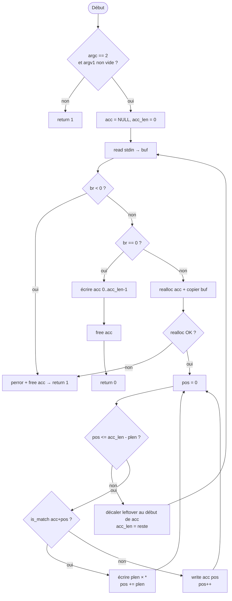

# 🎯 Rank 03 — Solutions Finales (Best-Of)

## 📋 Cheat Sheet

| # | Exercice | ~Lignes | Mémo clé |
|---|----------|---------|----------|
| 1 | `broken_gnl` | 20 | `read(fd, &c, 1)` en boucle, `malloc(100000)` |
| 2 | `filter` | 35 | Read tout stdin → realloc, scan & write `*` |
| 3 | `n_queens` | 40 | Globales + `safe()` + `solve()` récursif |
| 4 | `permutations` | 35 | Tri sélection + backtracking `used[]` |
| 5 | `powerset` | 30 | Backtracking binaire (inclure/exclure) |
| 6 | `rip` | 45 | 2 passes : `find` min → `gen` solutions |

---

# Level 1

---

## 1. `broken_gnl`

> **Fichiers** : `get_next_line.c` + `get_next_line.h` — **Autorisé** : `read`, `free`, `malloc`

> [!TIP]
> **HACK** : On réécrit tout. Read char par char = pas de buffer statique à gérer.
> `malloc(1000000)` = pas de realloc. La moulinette ne vérifie pas que BUFFER_SIZE est utilisé dans `read()`.

#### `get_next_line.h`
```c
#ifndef GNL
# define GNL
# include <stdlib.h>
# include <unistd.h>
# ifndef BUFFER_SIZE
#  define BUFFER_SIZE 10
# endif
char	*get_next_line(int fd);
#endif
```

#### `get_next_line.c`
```c
#include "get_next_line.h"

char	*get_next_line(int fd)
{
	char	*line;
	char	ch;
	int		i;
	int		read_res;

	if (fd < 0 || BUFFER_SIZE <= 0)
		return (NULL);
	line = malloc(1000000);
	if (!line)
		return (NULL);
	i = 0;
	while ((read_res = read(fd, &ch, 1)) > 0)
	{
		line[i++] = ch;
		if (ch == '\n')
			break ;
	}
	if (read_res < 0 || i == 0)
		return (free(line), NULL);
	line[i] = '\0';
	return (line);
}
```
#### `get_next_line.c version propre avec malloc au fur et a mesure`
```c
#include "get_next_line.h"

static char *append_char(char *line, char ch, int len)
{
    char    *tmp;
    int     i;

    tmp = malloc(len + 2);
    if (!tmp)
        return (free(line), NULL);
    i = 0;
    while (i < len)
    {
        tmp[i] = line[i];
        i++;
    }
    tmp[len] = ch;
    tmp[len + 1] = '\0';
    free(line);
    return (tmp);
}

char    *get_next_line(int fd)
{
    char    *line;
    char    ch;
    int     i;
    int     n;

    if (fd < 0 || BUFFER_SIZE <= 0)
        return (NULL);
    line = malloc(1);
    if (!line)
        return (NULL);
    line[0] = '\0';
    i = 0;
    while ((n = read(fd, &ch, 1)) > 0)
    {
        line = append_char(line, ch, i++);
        if (!line)
            return (NULL);
        if (ch == '\n')
            break ;
    }
    if (n < 0 || i == 0)
        return (free(line), NULL);
    return (line);
}
```

> [!NOTE]
> **Pourquoi char par char ?** Le fd avance exactement après le `\n` lu.
> Prochain appel → prochaine ligne. Zéro état statique, zéro bug.

**Workflow pour s'en souvenir :**
1. Gérer les erreurs de base (`fd < 0` ou `BUFFER_SIZE <= 0`).
2. Faire un gros `malloc(1000000)` pour éviter les `realloc`.
3. Lire caractère par caractère (`read(fd, &ch, 1)`) dans une boucle avec `pos`.
4. Stocker chaque caractère et s'arrêter si on rencontre un `\n`.
5. Gérer les erreurs de lecture, ajouter le `\0` final et retourner.

---

## 2. `filter`

> **Fichier** : `filter.c` — **Autorisé** : `read`, `write`, `strlen`, `realloc`, `free`, `perror`

```c
#include <unistd.h>
#include <stdlib.h>
#include <string.h>
#include <stdio.h>

static int	is_match(char *s, char *p, int plen)
{
    int	i;

    i = 0;
    while (i < plen)
    {
        if (s[i] != p[i])
            return (0);
        i++;
    }
    return (1);
}

int	main(int argc, char **argv)
{
    char	*pattern;
    int		plen;
    char	*acc;
    int		acc_len;
    char	buf[4096];
    int		br;
    int		pos;
    int		i;
    char	*tmp;

    if (argc != 2 || !argv[1][0])
        return (1);
    pattern = argv[1];
    plen = (int)strlen(pattern);
    acc = NULL;
    acc_len = 0;
    while (1)
    {
        br = read(0, buf, sizeof(buf));
        if (br < 0)
        {
            perror("Error");
            free(acc);
            return (1);
        }
        if (br == 0)
            break ;
        tmp = realloc(acc, acc_len + br);
        if (!tmp)
        {
            perror("Error");
            free(acc);
            return (1);
        }
        acc = tmp;
        i = 0;
        while (i < br)
        {
            acc[acc_len + i] = buf[i];
            i++;
        }
        acc_len += br;
        pos = 0;
        while (pos <= acc_len - plen)
        {
            if (is_match(acc + pos, pattern, plen))
            {
                i = 0;
                while (i < plen)
                {
                    write(1, "*", 1);
                    i++;
                }
                pos += plen;
            }
            else
            {
                write(1, acc + pos, 1);
                pos++;
            }
        }
        i = 0;
        while (pos + i < acc_len)
        {
            acc[i] = acc[pos + i];
            i++;
        }
        acc_len = i;
    }
    i = 0;
    while (i < acc_len)
    {
        write(1, acc + i, 1);
        i++;
    }
    free(acc);
    return (0);
}
```



**Workflow pour s'en souvenir :**
1. Valider les arguments :
	- argc != 2 ou argv[1] vide → return 1

2. Allouer la mémoire :
	- malloc pour buf et buf_acc → erreur → return 1

3. Boucle de lecture (read depuis stdin) :
	- bytes_read < 0 → perror + return 1
	- bytes_read == 0 → EOF → aller au flush final

4. Copier buf dans buf_acc
	- realloc la buf_acc pour faire de la place
	- boucle copy : buf_acc[buf_acc_len + copy] = buf[copy]

5. Scanner la buf_acc (tant que pos <= buf_acc_len - pattern_len)
	- is_match(buf_acc + pos, pattern) ?
	- oui → écrire N étoiles, pos += pattern_len
	- non → écrire buf_acc[pos], pos++

6. Décaler le leftover
	- les derniers bytes non traités (potentiel début de match) sont glissés au début de la buf_acc
	- retourner à l'étape 3

7. Flush final (après EOF)
	- écrire les bytes restants dans la buf_acc (plus assez pour un match complet)

8. return 0

---

# Level 2

---

## 3. `n_queens`

> **Fichier** : `*.c` — **Autorisé** : `atoi`, `write`, `malloc`, `free`, etc.

```c
#include <unistd.h>
#include <stdlib.h>

int	g_n;
int	g_pos[100];

void	pw(int nb)
{
	char	c;

	if (nb >= 10)
		pw(nb / 10);
	c = nb % 10 + '0';
	write(1, &c, 1);
}

void	print(void)
{
	int	i;

	i = -1;
	while (++i < g_n)
	{
		pw(g_pos[i]);
		write(1, i < g_n - 1 ? " " : "\n", 1);
	}
}

int	safe(int col, int row)
{
	int	i;
	int	d;

	i = -1;
	while (++i < col)
	{
		if (g_pos[i] == row)
			return (0);
		d = g_pos[i] - row;
		if (d < 0)
			d = -d;
		if (d == col - i)
			return (0);
	}
	return (1);
}

void	solve(int col)
{
	int	row;

	if (col == g_n)
		return (print());
	row = -1;
	while (++row < g_n)
		if (safe(col, row))
		{
			g_pos[col] = row;
			solve(col + 1);
		}
}

int	main(int ac, char **av)
{
	if (ac != 2)
		return (1);
	g_n = atoi(av[1]);
	if (g_n <= 0 || g_n > 100)
		return (0);
	solve(0);
	return (0);
}
```

> [!NOTE]
> **Mémo** : `g_pos[col] = row`. `safe` vérifie ligne (`==`) et diagonale (`|diff| == distance`).
> `solve` avance colonne par colonne. `return (print())` car print est void → évite if/else.

**Workflow pour s'en souvenir :**
1. Variables globales : `g_n` (taille de l'échiquier), tableau `g_pos` où l'index est la colonne et la valeur la ligne choisie.
2. Fonction `safe(col, row)` : vérifier pour toutes les colonnes d'avant (`i < col`) :
   - Same row ? `g_pos[i] == row`
   - Same diagonale ? Valeur absolue de `g_pos[i] - row` == distance entre les colonnes (`col - i`).
3. Fonction `solve(col)` : 
   - Si `col == g_n`, jouter l'échiquier valide avec `print()`.
   - Sinon, essayer de placer une dame de `row = 0` à `g_n-1`. Si `safe(col, row)` ok → assigner `g_pos[col] = row` puis `solve(col + 1)`. 
4. Lancer avec `solve(0)` dans le `main`.

---

## 4. `permutations`

> **Fichier** : `*.c` — **Autorisé** : `puts`, `write`, `malloc`, `calloc`, `realloc`, `free`

```c
#include <unistd.h>

int		g_len;
char	g_src[200];
char	g_res[200];
int		g_used[200];

void	perm(int pos)
{
	int	i;

	if (pos == g_len)
	{
		write(1, g_res, g_len);
		write(1, "\n", 1);
		return ;
	}
	i = -1;
	while (++i < g_len)
	{
		if (!g_used[i])
		{
			g_used[i] = 1;
			g_res[pos] = g_src[i];
			perm(pos + 1);
			g_used[i] = 0;
		}
	}
}

int	main(int ac, char **av)
{
	int		i;
	int		j;
	char	t;

	if (ac != 2 || !av[1][0])
		return (1);
	g_len = 0;
	while (av[1][g_len])
	{
		if (g_len >= 199)
			return (1);
		g_src[g_len] = av[1][g_len];
		g_len++;
	}
	i = -1;
	while (++i < g_len - 1)
	{
		j = i;
		while (++j < g_len)
			if (g_src[i] > g_src[j])
			{
				t = g_src[i];
				g_src[i] = g_src[j];
				g_src[j] = t;
			}
	}
	perm(0);
	return (0);
}
```

> [!NOTE]
> **Mémo** : Tri sélection d'abord → garantit l'ordre alphabétique.
> `g_used[i]` = ce char est déjà pris dans la permutation courante.

**Workflow pour s'en souvenir :**
1. Mettre les lettres de `av[1]` dans `g_src` (déclaré en global). Mettre la taille dans `g_len`.
2. Trier le tableau `g_src` en ordre croissant (facile = boucle imbriquée façon Bubble / Selection sort avec `i` et `j`).
3. Créer une fonction récursive `perm(pos)`. 
   - Condition de fin : si `pos == g_len`, write la chaîne `g_res` (aussi globale).
4. Sinon, boucle `0` à `g_len-1` :
   - Si la lettre `i` n'est pas déjà dans un état "utilisé" (`g_used[i] == 0`), on la prend.
   - On met `g_used[i] = 1`, on copie  `g_res[pos] = g_src[i]`.
   - On fait l'appel récursif : `perm(pos + 1)`.
   - Et BACKTRACKING : on la remet dispo via `g_used[i] = 0`.

---

## 5. `powerset`

> **Fichier** : `*.c` — **Autorisé** : `atoi`, `printf`, `malloc`, `free`, etc.

```c
#include <stdio.h>
#include <stdlib.h>

int	g_set[200];
int	g_sub[200];
int	g_sz;

void	bt(int idx, int ssub, int sum, int tgt)
{
	int	i;

	if (idx == g_sz)
	{
		if (sum == tgt)
		{
			i = -1;
			while (++i < ssub)
				printf(i ? " %d" : "%d", g_sub[i]);
			printf("\n");
		}
		return ;
	}
	bt(idx + 1, ssub, sum, tgt);
	g_sub[ssub] = g_set[idx];
	bt(idx + 1, ssub + 1, sum + g_set[idx], tgt);
}

int	main(int ac, char **av)
{
	int	i;

	if (ac < 3)
		return (0);
	g_sz = ac - 2;
	i = -1;
	while (++i < g_sz)
		g_set[i] = atoi(av[i + 2]);
	bt(0, 0, 0, atoi(av[1]));
	return (0);
}
```

> [!TIP]
> **Améliorations intégrées** :
> - Format `i ? " %d" : "%d"` (pris de copilot) → plus élégant, pas besoin de connaître `ssub`.
> - Subset vide (target=0) : la boucle ne s'exécute pas (ssub=0), juste `printf("\n")` → ligne vide correcte.

**Workflow pour s'en souvenir :**
1. Variables globales : `g_sz` (taille de nos nombres globaux `ac - 2`), liste de ces int `g_set`, array pour les reponses `g_sub`.
2. Fonction `bt(index, sub_size, current_sum, target_sum)` :
   - Arrêt: arrivé au bout du tableau `index == g_sz`.
   - SI `current_sum == target_sum` ALORS imprimer tous les éléments `g_sub[0]` à `sub_size-1`. (Gérer l'espace avec `i ? " %d" : "%d"`) puis `\n`.
3. Sinon tester les deux branches (Backtracking binaire) :
   - Exclure: on ajoute seulement à l'index global : `bt(idx + 1, ssub, sum, tgt)` 
   - Inclure : on ajoute à l'index global ET au sub courant : `g_sub[ssub] = g_set[idx]` puis appel `bt(idx + 1, ssub + 1, sum + g_set[idx], tgt)`

---

## 6. `rip`

> **Fichier** : `*.c` — **Autorisé** : `puts`, `write`

```c
#include <unistd.h>

int	g_len;

int	bal(char *s)
{
	int	b;
	int	i;

	b = 0;
	i = -1;
	while (s[++i])
	{
		if (s[i] == '(')
			b++;
		else if (s[i] == ')' && --b < 0)
			return (0);
	}
	return (b == 0);
}

void	find(char *s, int *m, int i, int r)
{
	char	c;

	if (r > *m)
		return ;
	if (bal(s))
	{
		if (r < *m)
			*m = r;
		return ;
	}
	while (s[i])
	{
		if (s[i] == '(' || s[i] == ')')
		{
			c = s[i];
			s[i] = ' ';
			find(s, m, i + 1, r + 1);
			s[i] = c;
		}
		i++;
	}
}

void	gen(char *s, int m, int i, int r)
{
	char	c;

	if (r > m)
		return ;
	if (bal(s) && r == m)
	{
		write(1, s, g_len);
		write(1, "\n", 1);
		return ;
	}
	while (s[i])
	{
		if (s[i] == '(' || s[i] == ')')
		{
			c = s[i];
			s[i] = ' ';
			gen(s, m, i + 1, r + 1);
			s[i] = c;
		}
		i++;
	}
}

int	main(int ac, char **av)
{
	int	m;

	if (ac != 2 || !av[1][0])
		return (1);
	g_len = 0;
	while (av[1][g_len])
	{
		if (av[1][g_len] != '(' && av[1][g_len] != ')')
			return (1);
		g_len++;
	}
	m = g_len;
	find(av[1], &m, 0, 0);
	gen(av[1], m, 0, 0);
	return (0);
}
```

> [!NOTE]
> **Mémo** : `find` et `gen` ont la MÊME structure récursive.
> "Supprimer" = remplacer par `' '` (espace) pour garder la longueur constante.
> `bal()` ignore les espaces naturellement (ni `(` ni `)`).

**Workflow pour s'en souvenir :**
1. `bal(s)` : vérificateur. Ignorer tout ce qui n'est pas `(` ou `)`. Incrémenter la balance pour `(`. Décrémenter pour `)`, retourner false direct si `balance < 0`. Fin si `balance == 0`.
2. Fonction `find(s, max_replace, index_courant, remplacement_courant)` :
   - But: Chercher en minimum de coups un `bal(s) == true`.
   - On essaie toutes les possibilités : si on croise une parenthèse on lance un appel récursif puis on l'enlève virtuellement `s[i] = ' '` et relance `find(...)` (+1 sur r).
   - On store s'il marche dans `m`.
3. Fonction `gen(...)`: Fait PAREIL que `find()`. Sauf que `m` (le max) est imposé, au lieu d'être cherché.
   - Si `bal(s) == true` ET qu'on a fait EXACTEMENT `m` remplacements, on écrit la chaîne et on stoppe.

---

## 🧠 Pièges à retenir

| Piège | Où | Détail |
|-------|-----|--------|
| `realloc` sans temp ptr | `filter` | Si realloc fail → pointeur perdu. Toujours `safe_ptr = realloc(data, ...)` |
| Oublier le tri | `permutations` | Sans tri initial → ordre non alphabétique → moulinette fail |
| Subset vide | `powerset` | `target=0` → le subset vide `{}` matche (somme=0) → ligne vide |
| `bal()` ignore les espaces | `rip` | Les espaces ne sont ni `(` ni `)` → traversés sans toucher `b` |
| `return (print())` | `n_queens` | Fonctionne car `print` est `void`. Évite un `if/else` |
| `read(fd, &c, 1)` | `broken_gnl` | Pas besoin de BUFFER_SIZE dans read, juste dans la garde |
