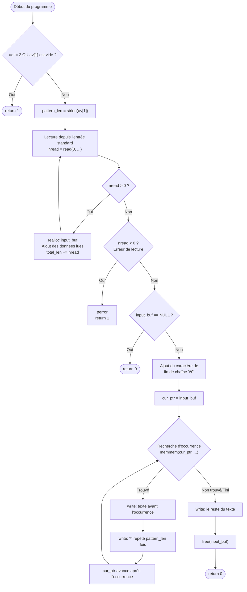

# Logique de `filter.c`

Voici un diagramme Mermaid représentant le flux d'exécution et la logique du fichier `filter.c` :

```mermaid
flowchart TD
    A([Début du programme]) --> B{"ac != 2 OU av[1] est vide ?"}
    B -- Oui --> C([return 1])
    B -- Non --> D["pattern_len = strlen(av[1])"]
    
    D --> E["Lecture depuis l'entrée standard<br>nread = read(0, ...)"]
    
    E --> F{"nread > 0 ?"}
    F -- Oui --> G["realloc input_buf<br>Ajout des données lues<br>total_len += nread"]
    G --> E
    
    F -- Non --> H{"nread < 0 ?<br>Erreur de lecture"}
    H -- Oui --> I["perror<br>return 1"]
    
    H -- Non --> J{"input_buf == NULL ?"}
    J -- Oui --> K([return 0])
    
    J -- Non --> L["Ajout du caractère de<br>fin de chaîne '\\0'"]
    L --> M["cur_ptr = input_buf"]
    
    M --> N{"Recherche d'occurrence<br>memmem(cur_ptr, ...)"}
    
    N -- Trouvé --> O["write: texte avant l'occurrence"]
    O --> P["write: '*' répété pattern_len fois"]
    P --> Q["cur_ptr avance après l'occurrence"]
    Q --> N
    
    N -- Non trouvé/Fini --> R["write: le reste du texte"]
    R --> S["free(input_buf)"]
    S --> T([return 0])
```
