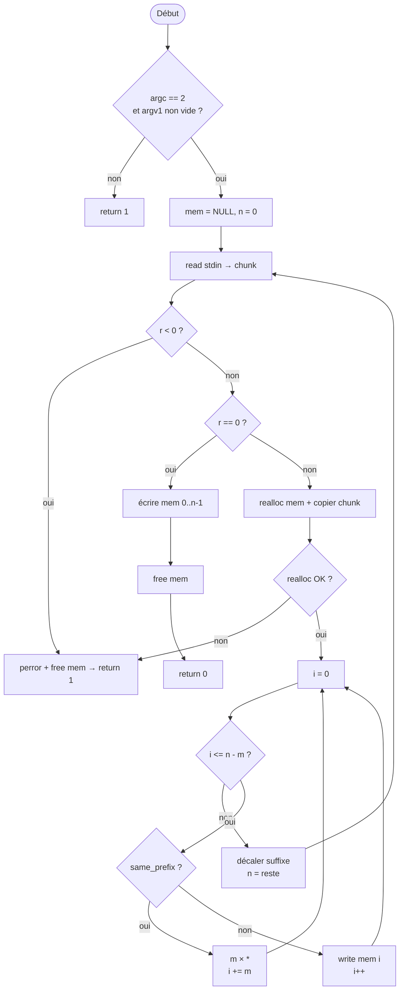

# Apprendre `filter.c` — étape par étape

Guide basé sur la fiche [`answer.md`](../../answer.md) (solution **streaming**, ~69 lignes).  
C’est la version à viser à l’exam : elle gère des `read()` de tailles aléatoires sans rater un motif coupé entre deux lectures.

**Références** : `filter_bis.c` (cursus-42), section **2. filter** dans `answer.md`.

---

## Étape 0 — Ce que le programme doit faire

**Entrée** : stdin + **un seul** argument `s` (non vide).  
**Sortie** : le texte de stdin, mais chaque occurrence de `s` devient autant d’étoiles que `strlen(s)`.

Exemple du sujet (`sub.txt`) :

```bash
echo 'abcdefaaaabcdeabcabcdabc' | ./filter abc | cat -e
# ***defaaa***de******d***
```

Équivalent mental : `sed 's/abc/***/g'`.

| Situation | Comportement |
|-----------|--------------|
| `argc != 2`, motif vide | `return 1` (sans message) |
| Erreur `read` / `realloc` | `perror` sur stderr, `return 1` |
| Succès | `return 0` |

**Fonctions autorisées** : `read`, `write`, `strlen`, `realloc`, `free`, `perror` (voir `sub.txt`).

---

## Étape 1 — Le piège central

Le sujet précise :

> *« tested with random buffer sizes, using a custom read »*

Le vrai piège n’est pas la taille du buffer local (`chunk[4096]`), c’est le **motif coupé entre deux `read()`** :

| Lecture 1 | Lecture 2 | Motif `abc` |
|-----------|-----------|-------------|
| `...ab`   | `c...`    | `abc` est à cheval sur les deux chunks |

Si tu traites le chunk 1 en écrivant `ab` tel quel, puis le chunk 2 sans garder `ab`, tu **rates** le match.

**Idée clé de la solution exam** :

1. Accumuler dans `mem` ce qui n’est pas encore « consommé ».
2. Scanner seulement la partie **sûre** : `i <= n - m` (assez d’octets pour un match complet).
3. **Décaler** le suffixe restant au début de `mem` avant le prochain `read`.
4. À la fin (EOF), écrire le suffixe trop court pour matcher.

> Une version « tout lire dans un gros buffer puis filtrer » peut passer sur de petits tests, mais la version **streaming + suffixe** est le standard exam et la seule robuste face aux `read` variables.

---

## Étape 2 — Workflow à mémoriser (6 points)

1. `argc == 2` et `av[1][0]` non nul → sinon `return 1`
2. Boucle `while ((r = read(...)) != 0)`  
   - `r < 0` → erreur  
   - `realloc` + copier le chunk dans `mem`  
   - scanner, remplacer ou écrire caractère par caractère  
   - **décaler** le suffixe
3. EOF (`r == 0`) → écrire ce qui reste dans `mem`
4. `free(mem)` → `return 0`

---

## Étape 3 — Includes et helper `same_prefix`

```c
#include <unistd.h>
#include <stdlib.h>
#include <string.h>
#include <stdio.h>   /* perror */
```

**`same_prefix(a, pat, m)`** : les `m` premiers octets de `a` sont-ils égaux à `pat` ?

```c
static int	same_prefix(char *a, char *pat, int m)
{
	int	k;

	k = 0;
	while (k < m && a[k] == pat[k])
		k++;
	return (k == m);
}
```

- Pas besoin de `memmem` (GNU).
- `m = strlen(av[1])`, calculé **une fois** au début.

---

## Étape 4 — Les variables

| Variable | Rôle |
|----------|------|
| `chunk[4096]` | Tampon d’un `read` |
| `mem` | Octets pas encore entièrement traités |
| `next` | Résultat de `realloc` (**jamais** écraser `mem` directement) |
| `n` | Longueur utile de `mem` |
| `m` | `strlen(motif)` |
| `r` | Retour de `read` |
| `i` | Index de scan dans `mem` |
| `k` | Compteur / copie (réutilisé) |

```c
if (ac != 2 || !av[1][0])
	return (1);
m = strlen(av[1]);
mem = NULL;
n = 0;
```

---

## Étape 5 — Boucle `read` + `realloc` + append

```c
while ((r = read(0, chunk, sizeof(chunk))) != 0)
{
	if (r < 0)
		return (perror("Error"), free(mem), 1);
	next = realloc(mem, n + r);
	if (!next)
		return (perror("Error"), free(mem), 1);
	mem = next;
	k = 0;
	while (k < r)
		mem[n++] = chunk[k++];
	/* scan + shift (étapes 6–7) */
}
```

**Pièges** :

- `perror("Error: ")` peut afficher `Error: : message` → utiliser `perror("Error")`.
- `mem = realloc(mem, ...)` sans pointeur temporaire → perte de `mem` si échec.

---

## Étape 6 — Le scan (remplacement)

```c
i = 0;
while (i <= n - m)
{
	if (same_prefix(mem + i, av[1], m))
	{
		k = 0;
		while (k++ < m)
			write(1, "*", 1);
		i += m;
	}
	else
		write(1, &mem[i++], 1);
}
```

**Pourquoi `i <= n - m` ?**  
Tant qu’il reste au moins `m` octets à partir de `i`, on peut décider match ou non. Le reste est gardé pour le chunk suivant ou le flush EOF.

**Chevauchement** : après un match, `i += m` (comportement type `sed` global).

---

## Étape 7 — Décalage du suffixe (indispensable)

```c
k = 0;
while (i + k < n)
{
	mem[k] = mem[i + k];
	k++;
}
n = k;
```

**Exemple** : motif `abc`, `mem = "ab"` en fin de chunk → le scan ne fait rien (`i <= n - m` faux). On garde `"ab"`. Au prochain `read`, `mem` peut devenir `"abc..."` → match.

---

## Étape 8 — EOF : flush du reste

```c
k = 0;
while (k < n)
	write(1, &mem[k++], 1);
return (free(mem), 0);
```

Suffixe **trop court** pour un match complet (ex. fin de fichier sur `...ab` sans le `c` de `abc`).

---

## Étape 9 — Schéma du flux



---

## Étape 10 — Trace manuelle

**Motif** : `abc`  
**stdin** en deux lectures : `"xxab"` puis `"cyy"`.

1. Après read 1 : `mem = "xxab"`, `n = 4`  
   - Scan : écrit `x`, `x` ; reste `ab` → `i = 2`, `n - m = 1` → fin scan  
   - Shift : `mem = "ab"`, `n = 2`

2. Après read 2 : `mem = "abcyy"`, `n = 5`  
   - Match à `i = 0` → `***`  
   - Écrit `y`, `y`  
   - Shift : vide

3. EOF : rien à flush  

**Résultat** : `xx***yy`

---

## Étape 11 — Ordre de rédaction à l’exam

1. `same_prefix` (~8 lignes)
2. `main` : check args + `m = strlen`
3. Boucle `read` + erreurs + `realloc` + copie
4. Boucle scan + `write`
5. Boucle shift
6. Flush final + `free`

Objectif : **~65–70 lignes**.

---

## Étape 12 — Pièges à retenir

| Piège | Solution |
|-------|----------|
| `realloc` direct sur `mem` | `next = realloc(mem, ...); if (!next) ...; mem = next;` |
| Oublier le shift | Match coupé entre deux `read` raté |
| `perror("Error: ")` | `perror("Error")` |
| Scanner après EOF sans flush | Derniers `m-1` octets perdus |
| Motif vide | `!av[1][0]` dans le check args |

---

## Solution complète (référence)

```c
#include <unistd.h>
#include <stdlib.h>
#include <string.h>
#include <stdio.h>

static int	same_prefix(char *a, char *pat, int m)
{
	int	k;

	k = 0;
	while (k < m && a[k] == pat[k])
		k++;
	return (k == m);
}

int	main(int ac, char **av)
{
	char	chunk[4096];
	char	*mem;
	char	*next;
	int		n;
	int		m;
	int		r;
	int		i;
	int		k;

	if (ac != 2 || !av[1][0])
		return (1);
	m = strlen(av[1]);
	mem = NULL;
	n = 0;
	while ((r = read(0, chunk, sizeof(chunk))) != 0)
	{
		if (r < 0)
			return (perror("Error"), free(mem), 1);
		next = realloc(mem, n + r);
		if (!next)
			return (perror("Error"), free(mem), 1);
		mem = next;
		k = 0;
		while (k < r)
			mem[n++] = chunk[k++];
		i = 0;
		while (i <= n - m)
		{
			if (same_prefix(mem + i, av[1], m))
			{
				k = 0;
				while (k++ < m)
					write(1, "*", 1);
				i += m;
			}
			else
				write(1, &mem[i++], 1);
		}
		k = 0;
		while (i + k < n)
		{
			mem[k] = mem[i + k];
			k++;
		}
		n = k;
	}
	k = 0;
	while (k < n)
		write(1, &mem[k++], 1);
	return (free(mem), 0);
}
```

---

## Exercices progressifs

1. Écrire seulement `same_prefix` + tests sur chaînes fixes.
2. Sans `read` : simuler deux chunks à la main, shift + scan.
3. Ajouter la boucle `read` + `realloc`.
4. Tester avec les commandes de `sub.txt` + `valgrind` si disponible.
5. Comparer avec une version « tout en mémoire » : noter pourquoi le streaming est requis à l’exam.

---

## Tests rapides

```bash
echo 'abcdefaaaabcdeabcabcdabc' | ./filter abc | cat -e
echo 'ababcabababc' | ./filter ababc | cat -e
./filter          # doit retourner 1
./filter ""       # doit retourner 1
```

---

## Liens

- Sujet : [`sub.txt`](sub.txt)
- Fiche globale rank03 : [`answer.md`](../../answer.md)
- Support commenté (autre approche) : [`filter.c`](filter.c)
