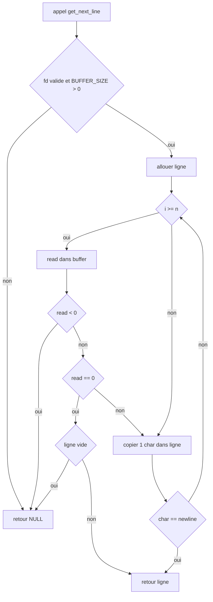
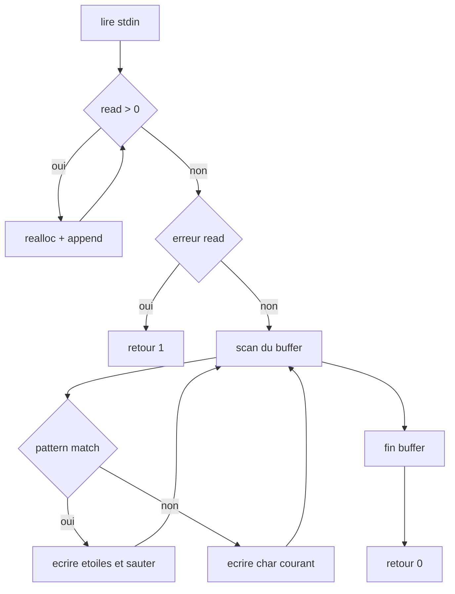
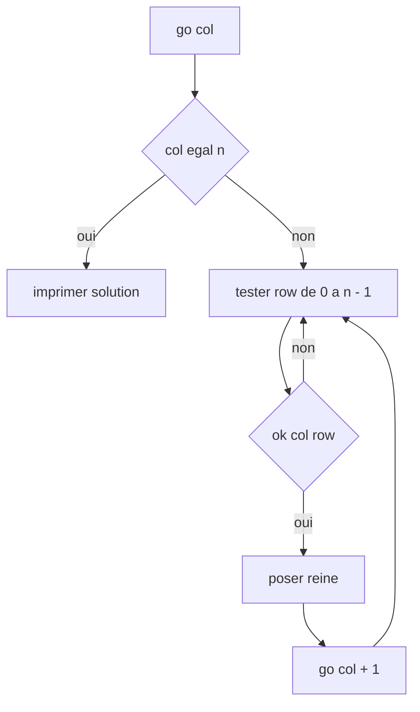
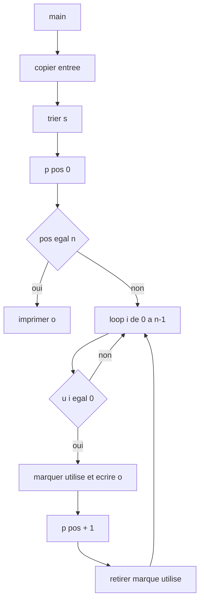
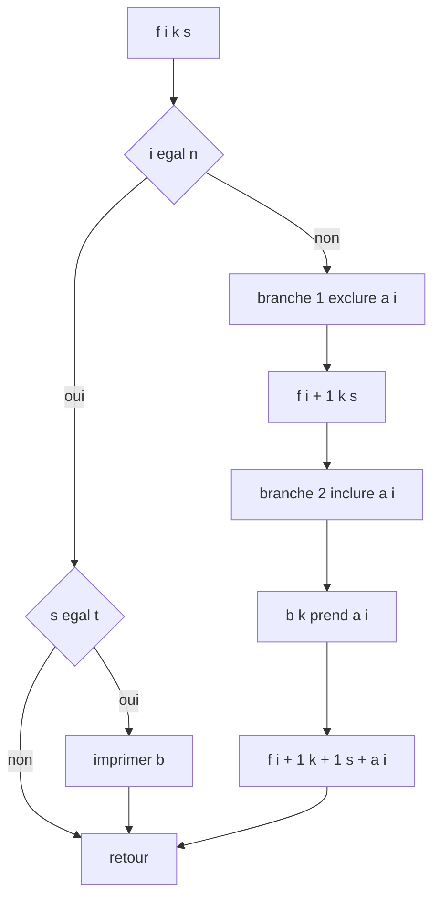
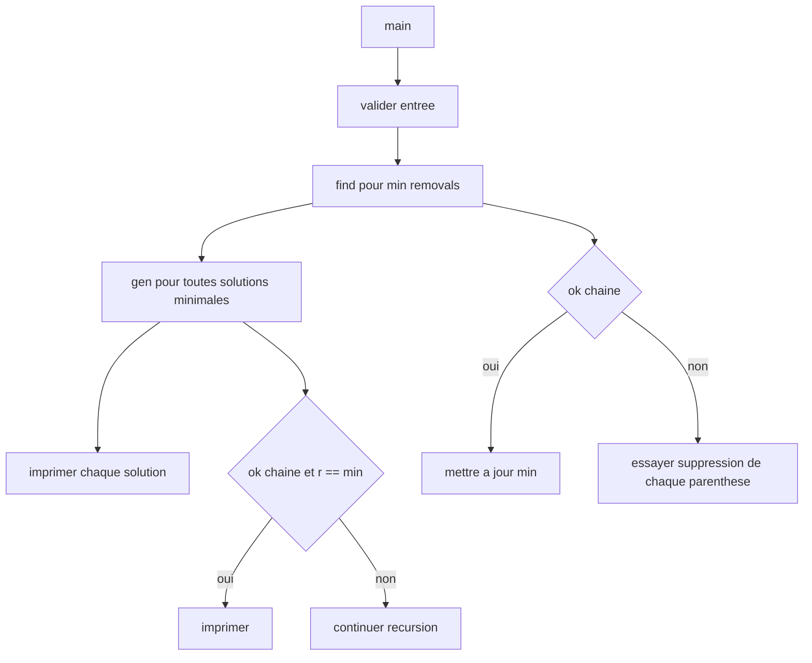

# Rank 03 - Solutions ultra-courtes (Copilot)

Principe: gagner des lignes sans tomber dans le code illisible.
Style: while partout, structure simple, et logique expliquée sous chaque exo.

Exercices gardes depuis solution.md:
- broken_gnl
- filter
- n_queens
- permutations
- powerset
- rip

---

## 1) broken_gnl

Fichiers: get_next_line.c + get_next_line.h

### get_next_line.h
```c
#ifndef GNL
# define GNL
# include <stdlib.h>
# include <unistd.h>
# ifndef BUFFER_SIZE
#  define BUFFER_SIZE 42
# endif
char	*get_next_line(int fd);
#endif
```

### get_next_line.c
```c
#include "get_next_line.h"

char	*get_next_line(int fd)
{
	static char	b[BUFFER_SIZE + 1];
	static int	i;
	static int	n;
	char	*s;
	int		l;

	if (fd < 0 || BUFFER_SIZE < 1)
		return (NULL);
	s = malloc(100000);
	if (!s)
		return (NULL);
	l = 0;
	while (1)
	{
		if (i >= n)
		{
			n = read(fd, b, BUFFER_SIZE);
			i = 0;
			if (n < 0)
				return (free(s), NULL);
			if (n == 0)
				break ;
		}
		s[l++] = b[i++];
		if (s[l - 1] == '\n')
			break ;
	}
	if (!l)
		return (free(s), NULL);
	s[l] = 0;
	return (s);
}
```

Details utiles:
- Le buffer statique `b` garde les restes entre deux appels.
- `read(fd, b, BUFFER_SIZE)` respecte la contrainte du sujet.
- On sort sur trois cas: erreur read, `\n` trouve, ou EOF.
- Si EOF et aucune donnee lue pour cette ligne: retour `NULL`.

Workflow visuel:


---

## 2) filter

Fichier: filter.c

```c
#include <unistd.h>
#include <stdlib.h>
#include <string.h>
#include <stdio.h>

int	main(int ac, char **av)
{
	char	b[4096], *s, *p;
	int		n, r, i, j, l;

	if (ac != 2 || !av[1][0])
		return (1);
	s = NULL;
	n = 0;
	l = strlen(av[1]);
	while ((r = read(0, b, 4096)) > 0)
	{
		p = realloc(s, n + r + 1);
		if (!p)
			return (perror("Error: "), free(s), 1);
		s = p;
		memmove(s + n, b, r);
		n += r;
	}
	if (r < 0)
		return (perror("Error: "), free(s), 1);
	if (!s)
		return (0);
	s[n] = 0;
	i = -1;
	while (s[++i])
	{
		j = 0;
		while (av[1][j] && s[i + j] == av[1][j])
			j++;
		if (j == l)
		{
			while (j--)
				write(1, "*", 1);
			i += l;
			i--;
		}
		else
			write(1, &s[i], 1);
	}
	return (free(s), 0);
}
```

Details utiles:
- Etape 1: lire tout `stdin` dans un buffer dynamique via `realloc`.
- Etape 2: scanner ce buffer de gauche a droite.
- Si le pattern match a la position `i`, ecrire `*` x longueur et sauter.
- Sinon ecrire le caractere courant, puis avancer d un cran.

Workflow visuel:


---

## 3) n_queens

Fichier: n_queens.c

```c
#include <unistd.h>
#include <stdlib.h>

int	n, p[100];

void	pn(int x)
{
	char	c;

	if (x > 9)
		pn(x / 10);
	c = x % 10 + '0';
	write(1, &c, 1);
}

int	ok(int c, int r)
{
	int	i;
	int	d;

	i = -1;
	while (++i < c)
	{
		if (p[i] == r)
			return (0);
		d = p[i] - r;
		if (d < 0)
			d = -d;
		if (d == c - i)
			return (0);
	}
	return (1);
}

void	go(int c)
{
	int	r;

	if (c == n)
	{
		r = -1;
		while (++r < n)
		{
			pn(p[r]);
			write(1, r < n - 1 ? " " : "\n", 1);
		}
		return ;
	}
	r = -1;
	while (++r < n)
	{
		if (ok(c, r))
		{
			p[c] = r;
			go(c + 1);
		}
	}
}

int	main(int ac, char **av)
{
	if (ac != 2)
		return (1);
	n = atoi(av[1]);
	if (n < 1 || n > 100)
		return (0);
	go(0);
	return (0);
}
```

Details utiles:
- `p[col] = row` stocke la ligne choisie pour chaque colonne.
- `ok` refuse conflit de ligne et conflit de diagonale.
- `go` avance colonne par colonne avec retour arriere implicite.
- Quand `col == n`, une solution complete est imprimee.

Workflow visuel:


---

## 4) permutations

Fichier: permutations.c

```c
#include <unistd.h>

int		n, u[200];
char	s[200], o[200];

void	p(int i)
{
	int	k;

	if (i == n)
	{
		write(1, o, n);
		write(1, "\n", 1);
		return ;
	}
	k = -1;
	while (++k < n)
	{
		if (!u[k])
		{
			u[k] = 1;
			o[i] = s[k];
			p(i + 1);
			u[k] = 0;
		}
	}
}

int	main(int ac, char **av)
{
	int		i;
	int		j;
	char	t;

	if (ac != 2 || !av[1][0])
		return (1);
	while (av[1][n] && n < 199)
	{
		s[n] = av[1][n];
		n++;
	}
	if (av[1][n])
		return (1);
	i = -1;
	while (++i < n - 1)
	{
		j = i;
		while (++j < n)
			if (s[i] > s[j])
			{
				t = s[i];
				s[i] = s[j];
				s[j] = t;
			}
	}
	p(0);
	return (0);
}
```

Details utiles:
- Copie du mot source dans `s[]` avec garde de taille.
- Tri initial pour forcer un ordre de sortie alphabetique.
- `u[i]` dit si le caractere `s[i]` est deja pris.
- Quand `pos == n`, on imprime la permutation construite.

Workflow visuel:


---

## 5) powerset

Fichier: powerset.c

```c
#include <stdio.h>
#include <stdlib.h>

int	a[200], b[200], n, t;

void	f(int i, int k, int s)
{
	int	j;

	if (i == n)
	{
		if (s == t)
		{
			j = 0;
			while (j < k)
			{
				printf(j ? " %d" : "%d", b[j]);
				j++;
			}
			printf("\n");
		}
		return ;
	}
	f(i + 1, k, s);
	b[k] = a[i];
	f(i + 1, k + 1, s + a[i]);
}

int	main(int ac, char **av)
{
	int	i;

	if (ac < 3)
		return (1);
	t = atoi(av[1]);
	n = ac - 2;
	i = -1;
	while (++i < n)
		a[i] = atoi(av[i + 2]);
	f(0, 0, 0);
	return (0);
}
```

Details utiles:
- A chaque index: deux choix, exclure ou inclure la valeur.
- `k` represente la taille courante du sous-ensemble `b[]`.
- `s` est la somme courante; comparee a `t` au cas terminal.
- L ordre des elements est conserve car l index ne recule jamais.

Workflow visuel:


---

## 6) rip

Fichier: rip.c

```c
#include <unistd.h>

int	l;

int	ok(char *s)
{
	int	b;
	int	i;

	b = 0;
	i = -1;
	while (s[++i])
	{
		if (s[i] == '(')
			b++;
		else if (s[i] == ')' && --b < 0)
			return (0);
	}
	return (!b);
}

void	find(char *s, int *m, int i, int r)
{
	char	c;

	if (r > *m)
		return ;
	if (ok(s))
	{
		if (r < *m)
			*m = r;
		return ;
	}
	while (s[i])
	{
		if (s[i] == '(' || s[i] == ')')
		{
			c = s[i];
			s[i] = ' ';
			find(s, m, i + 1, r + 1);
			s[i] = c;
		}
		i++;
	}
}

void	gen(char *s, int m, int i, int r)
{
	char	c;

	if (r > m)
		return ;
	if (ok(s) && r == m)
	{
		write(1, s, l);
		write(1, "\n", 1);
		return ;
	}
	while (s[i])
	{
		if (s[i] == '(' || s[i] == ')')
		{
			c = s[i];
			s[i] = ' ';
			gen(s, m, i + 1, r + 1);
			s[i] = c;
		}
		i++;
	}
}

int	main(int ac, char **av)
{
	int	m;

	if (ac != 2)
		return (1);
	while (av[1][l] == '(' || av[1][l] == ')')
		l++;
	if (av[1][l])
		return (1);
	m = l;
	find(av[1], &m, 0, 0);
	if (l)
		gen(av[1], m, 0, 0);
	return (0);
}
```

Details utiles:
- `ok` teste si la chaine est equilibree en parentheses.
- `find` explore toutes les suppressions pour trouver le minimum `m`.
- `gen` rejoue l exploration en ne gardant que les solutions a `m` suppressions.
- Une suppression est representee par un espace pour garder la meme longueur.

Workflow visuel:


---

## Mini cheat recap

```
broken_gnl   -> read 1 char + gros malloc
filter       -> read tout stdin + scan lineaire
n_queens     -> globales + backtracking
permutations -> tri + backtracking with used[]
powerset     -> include/exclude recursion
rip          -> find min removals puis generate
```
