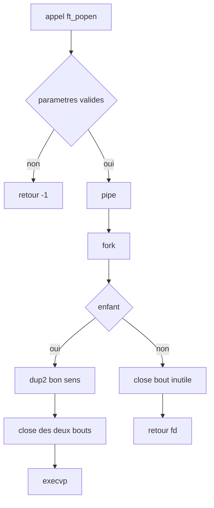
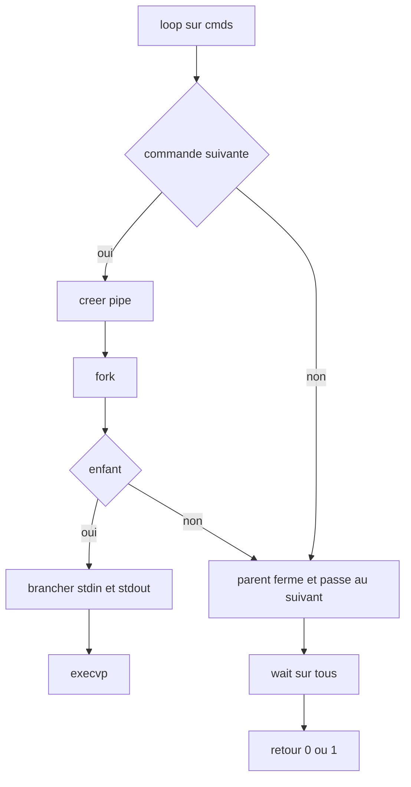
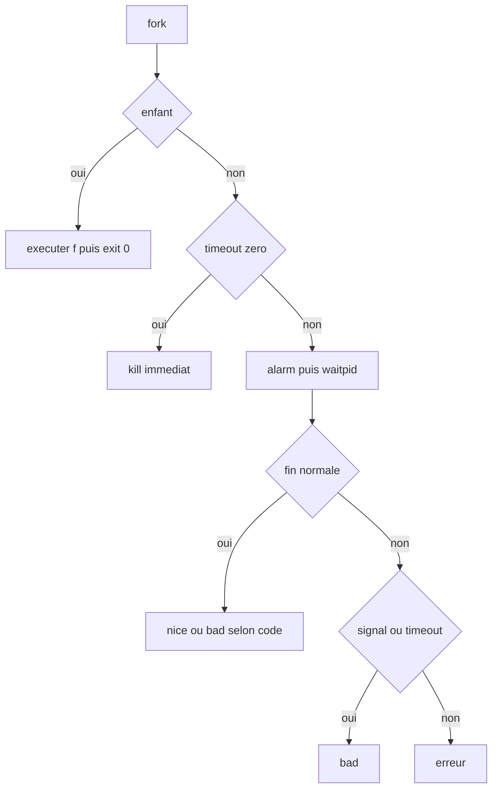
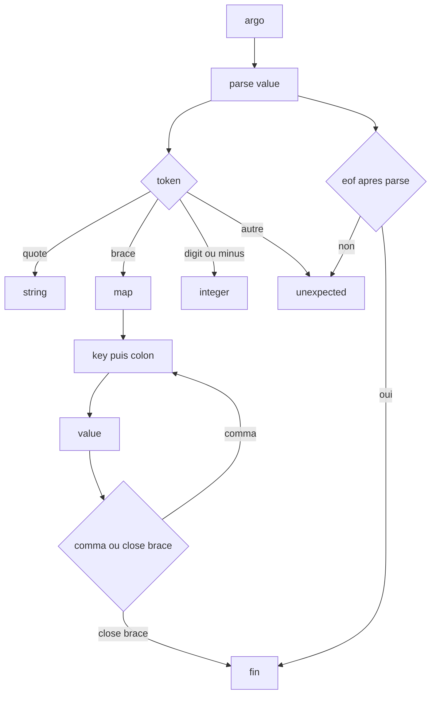
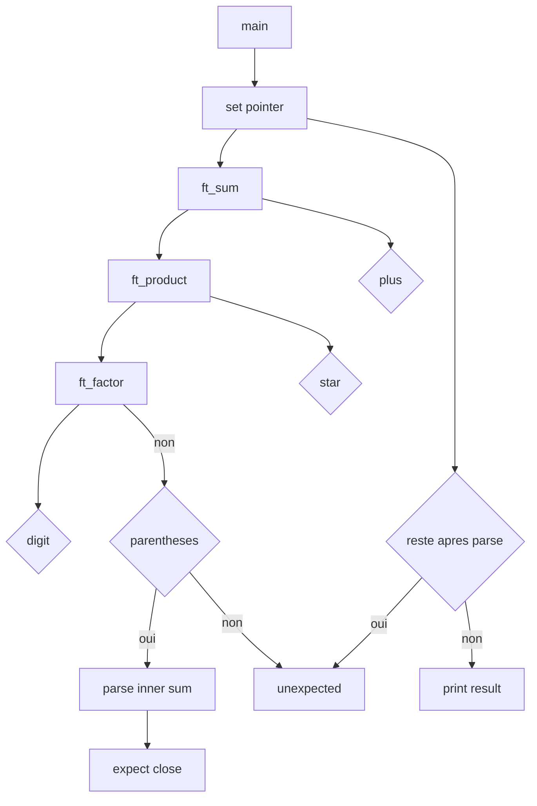

# Rank 04 - Solutions ultra-courtes (Copilot)

Principe: gagner des lignes sans perdre la lisibilite.
Style: boucles `while`, logique simple, et un workflow visuel pour chaque exercice.

Exercices gardes depuis `solution.md`:
- ft_popen
- picoshell
- sandbox
- argo
- vbc

---

## 1) ft_popen

Fichier: `ft_popen.c`

```c
#include <unistd.h>
#include <sys/types.h>
#include <stdlib.h>

int	ft_popen(const char *file, char *const argv[], char type)
{
	int		p[2];
	pid_t	pid;

	if (!file || !argv || (type != 'r' && type != 'w'))
		return (-1);
	if (pipe(p) == -1)
		return (-1);
	pid = fork();
	if (pid == -1)
		return (close(p[0]), close(p[1]), -1);
	if (pid == 0)
	{
		if (type == 'r')
		{
			if (dup2(p[1], 1) == -1)
				exit(1);
		}
		else if (dup2(p[0], 0) == -1)
			exit(1);
		close(p[0]);
		close(p[1]);
		execvp(file, argv);
		exit(1);
	}
	if (type == 'r')
		return (close(p[1]), p[0]);
	return (close(p[0]), p[1]);
}
```

Details utiles:
- `type == 'r'`: l'enfant envoie sa sortie standard dans le pipe.
- `type == 'w'`: l'enfant lit depuis le pipe sur son entree standard.
- Le parent ferme toujours le bout inutile avant de rendre le fd.
- Les deux bouts du pipe sont fermes dans l'enfant apres `dup2`.

Workflow visuel:


---

## 2) picoshell

Fichier: `picoshell.c`

```c
#include <unistd.h>
#include <stdlib.h>
#include <sys/wait.h>

static int	close_and_fail(int last_fd, int fd[2], int has_pipe)
{
	if (last_fd != -1)
		close(last_fd);
	if (has_pipe)
	{
		close(fd[0]);
		close(fd[1]);
	}
	while (wait(NULL) > 0)
		;
	return (1);
}

int	picoshell(char **cmds[])
{
	int		fd[2];
	int		last_fd;
	int		i;
	int		st;
	int		ret;
	pid_t	pid;

	last_fd = -1;
	i = 0;
	ret = 0;
	while (cmds[i])
	{
		if (cmds[i + 1] && pipe(fd) == -1)
			return (close_and_fail(last_fd, fd, 0));
		pid = fork();
		if (pid == -1)
			return (close_and_fail(last_fd, fd, cmds[i + 1] != NULL));
		if (pid == 0)
		{
			if (last_fd != -1 && dup2(last_fd, 0) == -1)
				exit(1);
			if (last_fd != -1)
				close(last_fd);
			if (cmds[i + 1])
			{
				close(fd[0]);
				if (dup2(fd[1], 1) == -1)
					exit(1);
				close(fd[1]);
			}
			execvp(cmds[i][0], cmds[i]);
			exit(1);
		}
		if (last_fd != -1)
			close(last_fd);
		if (cmds[i + 1])
		{
			close(fd[1]);
			last_fd = fd[0];
		}
		else
			last_fd = -1;
		i++;
	}
	while (wait(&st) > 0)
		if (!WIFEXITED(st) || WEXITSTATUS(st) != 0)
			ret = 1;
	return (ret);
}
```

Details utiles:
- Une seule boucle suffit pour chaainer toute la pipeline.
- `last_fd` garde le read end du pipe precedent.
- Le parent ferme le fd precedent des qu'il n'est plus utile.
- Un echec `pipe`, `fork` ou `execvp` remonte en code non nul.

Workflow visuel:


---

## 3) sandbox

Fichier: `sandbox.c`

```c
#include <stdbool.h>
#include <unistd.h>
#include <signal.h>
#include <errno.h>
#include <sys/wait.h>
#include <stdio.h>
#include <string.h>
#include <stdlib.h>

static void	alarm_handler(int sig)
{
	(void)sig;
}

int	sandbox(void (*f)(void), unsigned int timeout, bool verbose)
{
	struct sigaction	sa;
	pid_t			pid;
	int			st;
	int			w;

	if (!f)
		return (-1);
	sa.sa_handler = alarm_handler;
	sa.sa_flags = 0;
	sigemptyset(&sa.sa_mask);
	if (sigaction(SIGALRM, &sa, NULL) == -1)
		return (-1);
	pid = fork();
	if (pid == -1)
		return (-1);
	if (pid == 0)
	{
		f();
		exit(0);
	}
	if (!timeout)
	{
		kill(pid, SIGKILL);
		waitpid(pid, NULL, 0);
		if (verbose)
			printf("Bad function: timed out after %u seconds\n", timeout);
		return (0);
	}
	alarm(timeout);
	w = waitpid(pid, &st, WUNTRACED);
	if (w == -1)
	{
		if (errno == EINTR)
		{
			kill(pid, SIGKILL);
			waitpid(pid, NULL, 0);
			if (verbose)
				printf("Bad function: timed out after %u seconds\n", timeout);
			return (0);
		}
		return (-1);
	}
	alarm(0);
	if (WIFSTOPPED(st))
	{
		kill(pid, SIGKILL);
		waitpid(pid, NULL, 0);
		if (verbose)
			printf("Bad function: %s\n", strsignal(WSTOPSIG(st)));
		return (0);
	}
	if (WIFSIGNALED(st))
	{
		if (verbose)
			printf("Bad function: %s\n", strsignal(WTERMSIG(st)));
		return (0);
	}
	if (WIFEXITED(st) && WEXITSTATUS(st) == 0)
	{
		if (verbose)
			printf("Nice function!\n");
		return (1);
	}
	if (WIFEXITED(st))
	{
		if (verbose)
			printf("Bad function: exited with code %d\n", WEXITSTATUS(st));
		return (0);
	}
	return (-1);
}
```

Details utiles:
- Le parent attend le fils avec `waitpid` et gere `EINTR` pour le timeout.
- Un timeout force un `kill` puis un `waitpid` de reparation.
- `WIFSIGNALED` couvre segfault, abort et signaux fatals.
- `timeout == 0` est traite comme un timeout immediat.

Workflow visuel:


---

## 4) argo

Fichier: `argo.c`

> Base: garde les typedefs et les helpers du `given.c` (json, pair, free_json, serialize,
> unexpected, accept, expect). Le bloc ci-dessous remplace juste la partie parsing.

```c
static int	peek(FILE *stream)
{
	int	c;

	c = getc(stream);
	if (c != EOF)
		ungetc(c, stream);
	return (c);
}

static char	*get_str(FILE *stream)
{
	char	*s;
	char	*t;
	size_t	len;
	size_t	cap;
	int		c;

	cap = 16;
	len = 0;
	if (!(s = malloc(cap)))
		return (NULL);
	(void)getc(stream);
	while ((c = getc(stream)) != EOF)
	{
		if (c == '"')
		{
			s[len] = 0;
			return (s);
		}
		if (c == '\\')
		{
			c = getc(stream);
			if (c == EOF)
			{
				free(s);
				unexpected(stream);
				return (NULL);
			}
		}
		if (len + 1 >= cap)
		{
			cap *= 2;
			t = realloc(s, cap);
			if (!t)
			{
				free(s);
				return (NULL);
			}
			s = t;
		}
		s[len++] = c;
	}
	free(s);
	unexpected(stream);
	return (NULL);
}

static int	parse_value(json *dst, FILE *stream);

static int	parse_int(json *dst, FILE *stream)
{
	int	c;
	int	sign;
	int	n;

	sign = 1;
	n = 0;
	c = peek(stream);
	if (c == '-')
	{
		(void)getc(stream);
		sign = -1;
		c = peek(stream);
	}
	if (!isdigit(c))
		return (unexpected(stream), -1);
	while (isdigit(peek(stream)))
		n = n * 10 + (getc(stream) - '0');
	dst->type = INTEGER;
	dst->integer = n * sign;
	return (1);
}

static int	parse_map(json *dst, FILE *stream)
{
	pair	*tmp;
	pair	*cur;

	dst->type = MAP;
	dst->map.data = NULL;
	dst->map.size = 0;
	(void)getc(stream);
	if (peek(stream) == '}')
		return ((void)getc(stream), 1);
	while (1)
	{
		if (peek(stream) != '"')
			return (unexpected(stream), -1);
		tmp = realloc(dst->map.data, (dst->map.size + 1) * sizeof(pair));
		if (!tmp)
			return (-1);
		dst->map.data = tmp;
		cur = &dst->map.data[dst->map.size];
		cur->key = get_str(stream);
		if (!cur->key)
			return (-1);
		cur->value.type = INTEGER;
		cur->value.integer = 0;
		cur->value.map.data = NULL;
		cur->value.map.size = 0;
		dst->map.size++;
		if (!expect(stream, ':'))
			return (-1);
		if (parse_value(&cur->value, stream) == -1)
			return (-1);
		if (peek(stream) == '}')
			return ((void)getc(stream), 1);
		if (!accept(stream, ','))
			return (unexpected(stream), -1);
	}
}

static int	parse_value(json *dst, FILE *stream)
{
	int	c;

	c = peek(stream);
	if (c == EOF)
		return (unexpected(stream), -1);
	if (c == '{')
		return (parse_map(dst, stream));
	if (c == '"')
	{
		dst->type = STRING;
		dst->string = get_str(stream);
		if (!dst->string)
			return (-1);
		return (1);
	}
	if (isdigit(c) || c == '-')
		return (parse_int(dst, stream));
	unexpected(stream);
	return (-1);
}

int	argo(json *dst, FILE *stream)
{
	if (!dst || !stream)
		return (-1);
	*dst = (json){0};
	if (parse_value(dst, stream) == -1)
	{
		free_json(*dst);
		return (-1);
	}
	if (peek(stream) != EOF)
	{
		unexpected(stream);
		free_json(*dst);
		return (-1);
	}
	return (1);
}
```

Details utiles:
- `parse_value` choisit entre integer, string ou map selon le premier token.
- `get_str` ne gere que `\\` et `\"`, puis recopie le caractere utile.
- `parse_map` pousse les paires une par une et laisse `free_json` nettoyer en cas d'erreur.
- `argo` verifie aussi qu'il ne reste rien apres le premier JSON.

Workflow visuel:


---

## 5) vbc

Fichier: `vbc.h`

```c
#ifndef VBC_H
# define VBC_H

# include <stdio.h>
# include <ctype.h>

void	unexpected(char c);
int		ft_factor(void);
int		ft_product(void);
int		ft_sum(void);

#endif
```

Fichier: `vbc.c`

```c
#include "vbc.h"

char	*s;

void	unexpected(char c)
{
	if (c)
		printf("Unexpected token '%c'\n", c);
	else
		printf("Unexpected end of input\n");
}

int	ft_factor(void)
{
	int	n;

	if (isdigit(*s))
		return (*s++ - '0');
	if (*s == '(')
	{
		s++;
		n = ft_sum();
		if (n < 0)
			return (-1);
		if (*s != ')')
			return (unexpected(*s), -1);
		s++;
		return (n);
	}
	return (unexpected(*s), -1);
}

int	ft_product(void)
{
	int	a;
	int	b;

	a = ft_factor();
	if (a < 0)
		return (-1);
	while (*s == '*')
	{
		s++;
		b = ft_factor();
		if (b < 0)
			return (-1);
		a *= b;
	}
	return (a);
}

int	ft_sum(void)
{
	int	a;
	int	b;

	a = ft_product();
	if (a < 0)
		return (-1);
	while (*s == '+')
	{
		s++;
		b = ft_product();
		if (b < 0)
			return (-1);
		a += b;
	}
	return (a);
}

int	main(int argc, char **argv)
{
	int	n;

	if (argc != 2)
		return (1);
	s = argv[1];
	if (!*s)
		return (unexpected(0), 1);
	n = ft_sum();
	if (n < 0)
		return (1);
	if (*s)
		return (unexpected(*s), 1);
	printf("%d\n", n);
	return (0);
}
```

Details utiles:
- `sum` gere les `+`, `product` gere les `*`, `factor` gere chiffres et parentheses.
- Le pointeur global `s` avance dans la chaine au fur et a mesure du parsing.
- La fin d'input est verifiee apres le parse complet pour attraper les tokens restants.
- Pas de check_input separe: l'erreur est detectee au moment du parsing.

Workflow visuel:


---

## Mini recap

```
ft_popen   -> pipe + fork, child dup2 puis execvp
picoshell  -> boucle cmds[], last_fd chaine les pipes, wait a la fin
sandbox    -> fork + alarm + waitpid, timeout et signaux geres
argo       -> given.c + parse recursive value/string/map
vbc        -> sum -> product -> factor, pointeur global s
```
